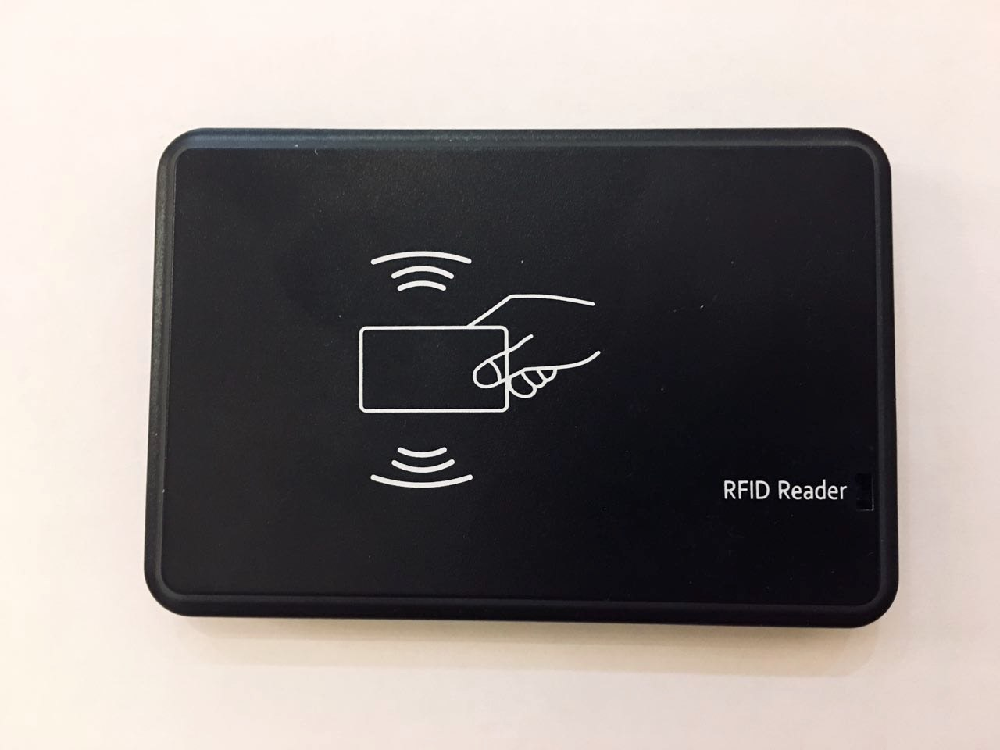

# pyrfid
Python code to control Chinese USB HID 125Khz RFID Reader/Writer.

# Introduction
This code is the result of reverse-engineering the communication protocol of a Chinese USB 125Khz RFID Reader/Writer.
# Description
The code can be used as example to control the USB RFID device under Linux or MacOS, and it uses [hidapi](https://pypi.org/project/hidapi/).
Write operation supported for EM4305/4205 and T5577/5557 tags.
